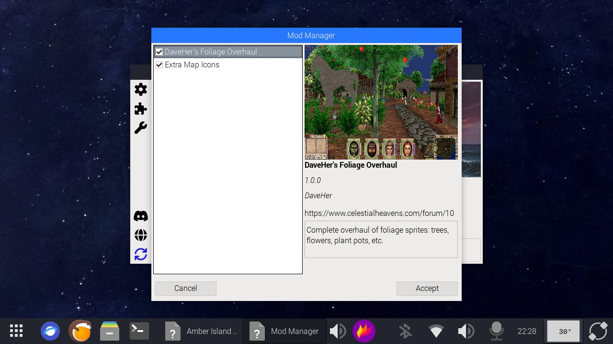

# Amber Launcher

Amber Launcher is a game launcher designed specifically for **[Might & Magic 7: Amber Island](https://github.com/neutonm/might-and-magic-amber-island-mod)** - a custom, expansion-like mod for *[Might & Magic 7: For Blood and Honor](https://www.gog.com/en/game/might_and_magic_7_for_blood_and_honor)* (1999) by New World Computing / 3DO.

## Features

Amber Launcher offers:

- **Auto Configuration** - Copies the base game, adjusts settings, and applies tweaks to support the mod.
- **GrayFace Patch Integration** - Easily enable and tweak GrayFace patch features through a user-friendly interface.
- **Mod Support** - Includes a custom mod manager for feature expansion.
- **Localization Support** - Simplifies switching and managing localizations.
- **Updates** - Keeps both the game and the launcher up to date without requiring manual downloads or patches.




---

## Game Requirement

To use Amber Launcher, you must own an original copy of *Might & Magic 7: For Blood and Honor* (1999).  
The best way to get a working copy is through **[GOG.com](https://www.gog.com/en/game/might_and_magic_7_for_blood_and_honor)**.

Amber Launcher comes preconfigured with the **Might & Magic 7: Amber Island** mod (latest stable version).  
You don't need to download the mod separately - the launcher will automatically install and configure it for you during setup.

## Build Instructions

Amber Launcher is written in **C** (C89 standard), uses **[Lua](https://www.lua.org/)** as an embedded scripting language, and **[NappGUI](https://nappgui.com/)** for the user interface.

You will need:

- **[Git](https://git-scm.com/)**
- **[CMake](https://cmake.org/)**

to build the project on any platform.

#### Windows

To build on Windows, you will need **[MSVC (Community Edition)](https://visualstudio.microsoft.com/vs/community/)**.  
CMake will automatically download and build Lua and NappGUI for you.

```bash
# Configure and build using MSVC
cmake -B build -G "Visual Studio 17 2022"
cmake --build build --config Release
```

#### Linux

The game will be launched via Wine. You can adjust command launch arguments inside Options Window.

Install build essentials, GCC, and CMake first:
```bash
sudo apt update
sudo apt install build-essential gcc cmake ninja-build
```
Then configure and build using Ninja:

```bash
cmake -B build -G Ninja
cmake --build build --config Release
```

### License

MIT
 - feel free to use, modify, and contribute!